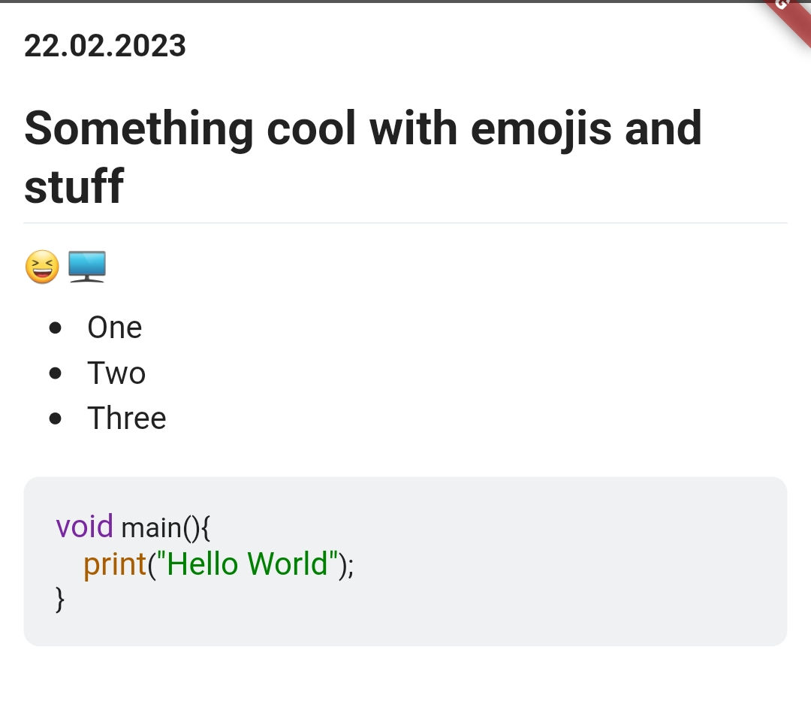

Provide a simple way to communicate with your users via a Markdown file. Usefull for changelogs, notifications, urgent information, status updates, development updates and more.


## Features
- No extra server needed, works with Github or similar services without issues
- Customize your data with the help of Markdown
- Offline support: Users can view past messages even without internet connection
- Easy to use
- Plug and Play component, which is partially customizable
- Minimal dependencies

## Getting started

- Install via `flutter pub get markdown_notifier` and `flutter pub get path_provider`
- Add your own Notification markdown file to your repository, name it as you like, I choose `NOTIFICATIONS.md`
- Add some content to the file, if you want to create sections use a `<br>` tag

## Images
<br>

 
<br>

If new data has been found this icon will be displayed, it's customizable


<br>

The dialog showing the notifications in order, just an example, it can look different depending on your styling of the Markdown file


<br>

The Dialog displaying the full notification.


<br>

If you have viewd all notification the icon looks like this, it's customizable as well

## Usage

It's easy to use:
1. Replace the url in `NotificationQueryLogic` with your url, it needs to be a raw link e.g. **raw**.githubusercontent . If you don't use Github make sure the data is returned plainly, not as a file.
2. Optional: Decide on a query duration, this is the time interval used to query the url for data
3. Decide on a path for the cache
4. Init the NotificationQueryLogic instance via the `.init` method
5. Place the `InfoButton` where you need it and pass it your instance of `NotifiationQueryLogic`

**Example:**
```dart
final queryLogic = NotificationQueryLogic(url:"https://raw.githubusercontent.com/Flajt/markdown_notifier/master/NOTIFICATIONS.md");
final dir = await getTemporaryDirectory();
await queryLogic.init(dir.path);
```
You can also find this in the example folder.

## Additional information

The package is currently rather bare bones, so if you need something feel free to open an issue and I will implement it if it's usefull, or implement it yourself if you can. The codebase is rather simple, so it should be easy to contribute. (If you do open a PR against the dev branch)
<br>

If you need donation buttons in your app consider checking out my other package here on [pub.dev](https://pub.dev/packages/flutter_donation_buttons)
<br>
Also consider donating on the Github page and/or leaving a like / star.